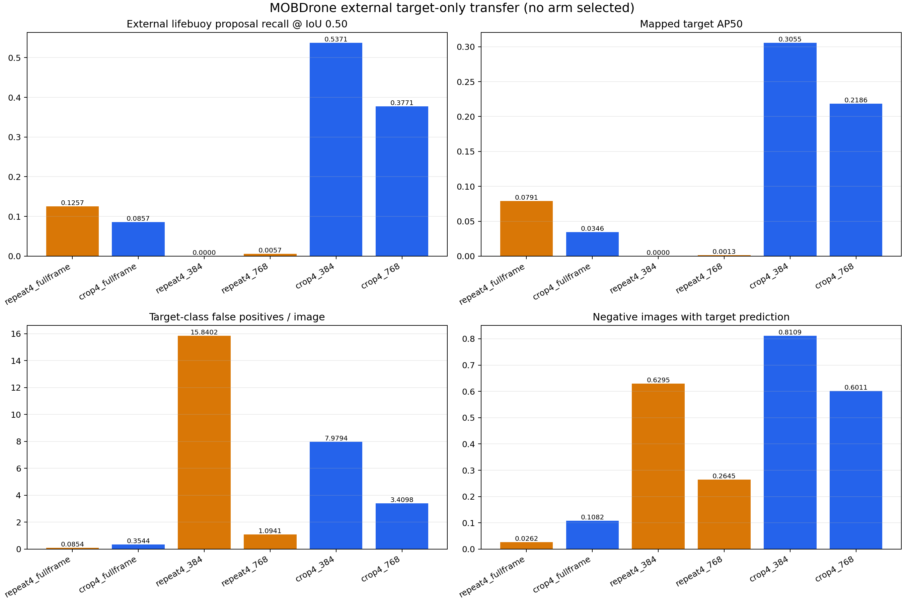

# 海事无人机检测：置信度校准、稀有目标与跨域验证

[English](README.md) · [研究全景](docs/RESEARCH_OVERVIEW.md) ·
[复现指南](docs/REPRODUCIBILITY.md) · [产物说明](docs/ARTIFACTS.md)

本项目从“飞行高度、云台角度等元数据能否改善检测置信度”出发，逐步研究训练稳定性、
分辨率、稀有正样本曝光、目标中心裁剪及跨数据集迁移。基础检测器是 Ultralytics
YOLOv8n；研究贡献在于实验控制、评价工具和有证据支持的故障分析。

## 主要结论

- 元数据校准降低 ECE，但恶化 Brier、NLL 和固定误报预算下的召回；不能仅用 ECE 宣称改善。
- 相同种子复跑再现第9轮坍塌；关闭 AMP 的对照恢复稳定，支持先排除优化问题。
- 640/1280 × 自然/4倍曝光四单元对照表明，分辨率提高总体 AP，稀有救生装备 AP 仍为零。
- Crop4 在已知目标位置的 oracle 裁剪及无位置先验的盲切片中恢复目标识别，支持呈现机制。
- MOBDrone 外部集上，Crop4 两个切片尺度的目标召回为 0.5371、0.3771，
  但每图目标误报为 7.98、3.41，尚不支持部署。



## 如何查看与复现

先读英文首页的实验导航，然后查看各阶段报告及同名 CSV/JSON。
只检查公开证据不需要 GPU、数据集或权重：

```bash
python -m pip install -e ".[dev]"
python -m pytest
python scripts/reproduce_published_results.py
python scripts/verify_publication.py
```

这会校验表格中的计算关系并重新绘制摘要图，不等于重新执行原始模型推理。
完整训练和数据重建步骤见复现指南。权重、原始数据、逐图预测及含原图的联系表保留在本地，
公开仓库提供哈希、来源、脚本和限制说明。

## 研究边界与后续工作

官方 validation 已在早期研究冻结后评估；后续稀有类别实验没有拿它选检测器。
detector-dev 已被用于早停及多轮诊断，不能称为未触碰的确认集。
MOBDrone 已关闭，不得用它挑选 checkpoint、阈值或切片尺寸。

proposal gate v1 仍是计划，尚无实现或实验结果。后续应在 detector-train 内按源分组开发
硬负样本门控，并使用新的外部数据做独立确认。当前研究为单种子证据，没有 SOTA、
部署就绪或已发表论文的声明。

作者：GU Kailei。研究代码和文档使用 Codex 辅助开发；原始代码采用 MIT，
数据集、Ultralytics 和权重各自遵循上游条款。
