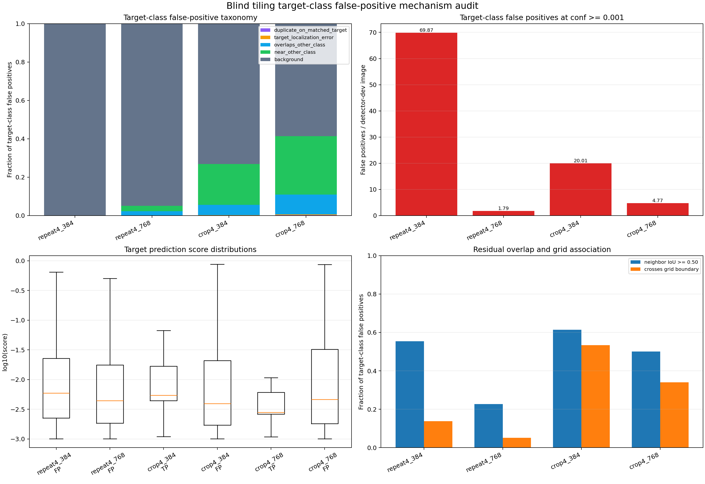

# Blind-Tiling Target-Class False-Positive Audit

## Scope

This post-freeze audit explains the `life_saving_appliances` false positives produced by the
completed blind-tiling sensitivity. It reads the four existing uncapped target-class exports after
the frozen cross-tile NMS and the 893-image detector-dev annotations. It does not rerun inference,
filter a prediction, sweep a threshold, choose a tile size, or train a model.

The audit was registered in `configs/blind_tiling_fp_mechanism_audit.yaml` before executing the
taxonomy. Detector-dev is already a reused diagnostic role, so all findings are descriptive. No
calibration-fit, policy-tune, official validation, or official test data are used.

## Frozen taxonomy

Predictions are assigned in this order:

1. one-to-one same-class true positive at IoU 0.50;
2. duplicate on an already matched target at IoU at least 0.50;
3. target localization error at target IoU from 0.10 to 0.50;
4. overlap with another active class at IoU at least 0.50;
5. proximity to another active class at IoU from 0.10 to 0.50;
6. background when neither target nor another active class reaches IoU 0.10.

Residual overlap is reported as another target-class prediction at IoU at least 0.50. The grid
diagnostic reconstructs fixed tile starts and ends and reports geometric boundary crossings. The
export did not retain each merged box's source tile, so grid association is not causal evidence.

## Results

| Condition | Target TP / 64 | Target FP / image | Background | Other-class associated | Residual neighbor IoU >= 0.50 | FP on target-negative images |
|---|---:|---:|---:|---:|---:|---:|
| Repeat4, 384 | 0 | 69.87 | 99.96% | 0.04% | 55.39% | 99.96% |
| Repeat4, 768 | 0 | 1.79 | 94.92% | 5.01% | 22.68% | 99.94% |
| Crop4, 384 | 13 | 20.01 | 73.14% | 26.67% | 61.38% | 90.35% |
| Crop4, 768 | 14 | 4.77 | 58.64% | 40.68% | 50.12% | 83.82% |

The FP/image values here are target-class-only. The earlier 279.68 and 154.62 Crop4 values were
all-class false positives at the export floor; they are different endpoints.

The main mechanisms are:

- **Background and non-target objects dominate.** Crop4 has only 35 target duplicates or
  localization errors at 384 and 29 at 768. By contrast, background contributes 13,072 and 2,497
  false positives, while other-class association contributes 4,766 and 1,732.
- **Swimmer is the largest annotated association.** It accounts for 3,319/4,766 associated Crop4
  false positives at 384 and 1,036/1,732 at 768. Boats, buoys, and jetskis account for the rest.
- **Residual overlap is substantial.** Half or more of the Crop4 false positives have another
  target-class prediction at IoU at least 0.50 even after the frozen 0.70 cross-tile NMS. This
  supports investigating a separately registered consensus/merge rule, but it does not select one.
- **Confidence alone is not a clean separator.** At 768, true-positive median confidence is
  0.00278, below the false-positive median of 0.00461; false-positive P95 is 0.495. Raising a global
  confidence threshold on detector-dev would both constitute prohibited selection and risk removing
  recovered targets before high-confidence false positives.
- **Scene effects remain material.** Repeat4's 384 failure is concentrated in
  `NorthSea_Fri_DJI_0115.MP4` at 206.87 target false positives per image. Crop4 is more distributed;
  its highest normalized rates are `DJI_0062.MP4` at 26.99 and 10.28 target false positives per
  image for 384 and 768.



The highest-confidence Crop4 false positives visually confirm that many boxes sit on or near
annotated swimmers, boats, buoys, or jetskis rather than representing small localization misses of
the target category.

The contact sheet is a local-only dataset-derived artifact. Regenerate it with the command below;
see [artifact availability](ARTIFACTS.md). The public analytical figure above contains no source pixels.

## Decision

No threshold, tile size, checkpoint, proposal rule, or merge rule is selected. The audit supports
three components for a future preregistered proposal path: cross-tile consensus or cluster fusion,
explicit rejection of swimmer/buoy/boat confusions, and source-robust background suppression.
Those components must be fixed without further detector-dev selection and evaluated once on new
untouched or external source-sequence data. Official validation remains frozen for final evaluation.

## Reproduction

```powershell
python scripts\analyze_blind_tiling_false_positives.py `
  --annotations artifacts\partitions\seed20260803\instances_detector_dev.json `
  --image-root D:\dataset\SeaDronesSee_ODv2\compressed\images\train `
  --condition repeat4_384 artifacts\sensitivities\blind_tiling_inference\predictions\repeat4_384_detector_dev.uncapped_target.json 384 `
  --condition repeat4_768 artifacts\sensitivities\blind_tiling_inference\predictions\repeat4_768_detector_dev.uncapped_target.json 768 `
  --condition crop4_384 artifacts\sensitivities\blind_tiling_inference\predictions\crop4_384_detector_dev.uncapped_target.json 384 `
  --condition crop4_768 artifacts\sensitivities\blind_tiling_inference\predictions\crop4_768_detector_dev.uncapped_target.json 768 `
  --output-dir results\sensitivities\blind_tiling_fp_audit
```
