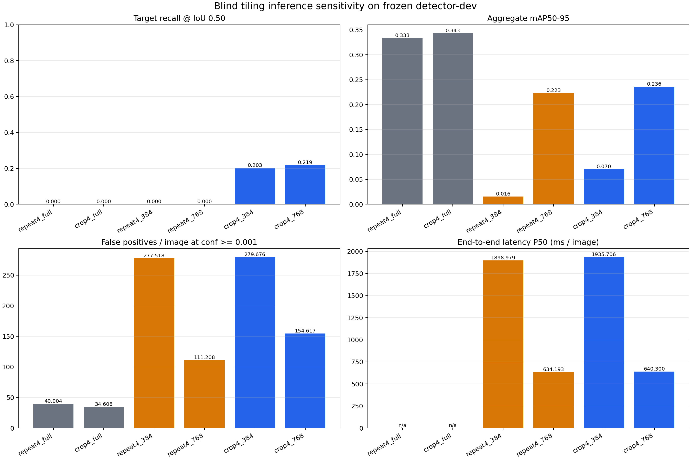

# Blind Tiling Inference Sensitivity

## Purpose and frozen boundary

The oracle target-crop diagnostic showed that Crop4-1280 can recognize
`life_saving_appliances` when the target is presented at a learned scale. This follow-up tests a
deployable, location-blind presentation path: uniformly tile every detector-dev frame, infer every
tile, map detections back to the original frame, and apply class-aware cross-tile NMS.

This is a post-freeze sensitivity analysis. It does not use target annotation locations during
inference, and it does not use official validation, calibration-fit, or policy-tune. Detector-dev
does not select a checkpoint, score threshold, or preferred tile size. Both frozen tile sizes are
reported.

## Frozen protocol

- Models: Repeat4-1280 (negative control) and Crop4-1280.
- Images: all 893 detector-dev images.
- Native tiles: 384 and 768 pixels, each with 25% overlap and far-edge anchoring.
- Per-tile inference: resize to 1280, confidence floor 0.001, NMS IoU 0.70, maximum 300 detections,
  FP32, no test-time augmentation.
- Merge: map boxes to native full-frame coordinates, class-aware NMS at IoU 0.70, then keep the
  top 300 detections per image for the primary AP comparison.
- Target diagnostic: also retain the post-merge target predictions before the global 300-detection
  cap, so target recall is not hidden by unrelated low-threshold detections.

## Results

All four tiled conditions completed on all 893 detector-dev images. The table uses one local
prediction-JSON evaluator for both full-frame and tiled rows. The full-frame rows therefore differ
from the earlier rect-batched Ultralytics validator manifests and must not replace those frozen
training reports.

| Condition | Target recall @ 0.50 | Uncapped target recall | Target AP50 | mAP50-95 | FP / image | P50 latency | P95 latency |
|---|---:|---:|---:|---:|---:|---:|---:|
| Repeat4 full frame | 0/64 | 0/64 | 0 | 0.33347 | 40.00 | n/a | n/a |
| Crop4 full frame | 0/64 | 0/64 | 0 | 0.34312 | 34.61 | n/a | n/a |
| Repeat4, 384 tile | 0/64 | 0/64 | 0 | 0.01574 | 277.52 | 1899 ms | 2016 ms |
| Repeat4, 768 tile | 0/64 | 0/64 | 0 | 0.22318 | 111.21 | 634 ms | 787 ms |
| Crop4, 384 tile | 13/64 (20.3%) | 13/64 | 0.00026 | 0.07030 | 279.68 | 1936 ms | 2667 ms |
| Crop4, 768 tile | 14/64 (21.9%) | 14/64 | 0.00084 | 0.23596 | 154.62 | 640 ms | 741 ms |

The mechanism result is positive and specific: location-blind tiling exposes the target
representation learned by Crop4, while the Repeat4 negative control remains at 0/64 for both tile
sizes. The global top-300 cap removes none of the matched Crop4 targets, because capped and
uncapped target recall are identical.

The operational result is not positive. Target AP remains near zero because the export floor
produces thousands of target-class false positives, and aggregate mAP falls below the full-frame
baseline. The 384 condition is especially costly at roughly 280 false positives and 1.9 seconds
per image. The 768 condition is less damaging but is not selected: detector-dev is a reused
post-freeze diagnostic role, not a tile-size tuning set. The supported claim is therefore that a
blind presentation path can recover some Crop4 target proposals, not that this implementation is
deployment-ready.

No official validation, calibration-fit, or policy-tune data were used, and no checkpoint,
threshold, or tile size was selected. A future deployable refinement would require a separately
registered proposal/merge rule and evaluation on new untouched or external sequence data.

