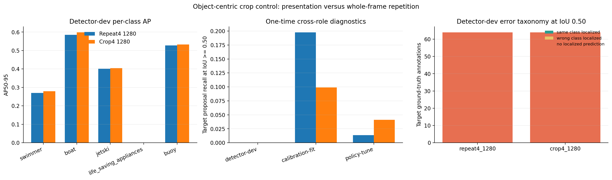

# Object-centric Crop4 control

## Question

The completed 2x2 resolution-by-exposure experiment improved aggregate detection and produced more
cross-role target matches, but `life_saving_appliances` still had zero AP and zero detector-dev
proposal recall. The follow-up error taxonomy found no same-class localization on detector-dev.
This registered control tests whether the missing factor is **how the rare object is presented**,
not simply how often the same whole frame is repeated.

## Frozen matched design

`Crop4-1280` keeps every one of the 6,251 detector-train source images once. Each of the 323 source
images containing `life_saving_appliances` contributes exactly three deterministic derived crops,
for 969 additional and 7,220 total training exposures. Every target instance in a source image is
retained in all three crops, so the effective target-instance exposure is 1,688, exactly matching
`Repeat4-1280`.

The three crop variants use context factors 8, 12, and 16 around the union of all target boxes,
with a minimum native side of 384 pixels. Crop boundaries expand to fully include every active
annotation they intersect. Therefore no annotated object is cut into an unlabeled fragment. The
source dataset is read-only; generated JPEGs, labels, recipes, and manifests live under ignored
`artifacts/object_centric_crop_control/`.

The only intended experimental change is:

- `Repeat4-1280`: repeat each target-positive whole frame three extra times.
- `Crop4-1280`: replace those 969 repeated paths with 969 target-group-centered derived images.

Model, initialization, resolution, batch, nominal batch, AMP setting, seed, optimizer, early
stopping, and detector-dev checkpoint selection remain frozen. Official validation is prohibited.

## Reproduce the derived data

```powershell
python scripts/prepare_object_centric_crop_control.py `
  --annotations artifacts/partitions/seed20260803/instances_detector_train.json `
  --source-image-root D:/dataset/SeaDronesSee_ODv2/compressed/images/train `
  --source-train-list D:/dataset/SeaDronesSee_ODv2/yolo/lists/detector_train.txt `
  --original-wrapper-image-root artifacts/rare_class_factorial/dataset/images/train `
  --detector-dev-list artifacts/rare_class_factorial/detector_dev_isolated.txt `
  --output-root artifacts/object_centric_crop_control `
  --output-train-list artifacts/object_centric_crop_control/detector_train_crop4.txt `
  --output-yaml artifacts/object_centric_crop_control/seadronessee_detector_crop4.yaml `
  --manifest artifacts/object_centric_crop_control/manifest.json `
  --forbidden-annotations `
    artifacts/partitions/seed20260803/instances_detector_dev.json `
    artifacts/partitions/seed20260803/instances_calibration_fit.json `
    artifacts/partitions/seed20260803/instances_policy_tune.json
```

Independently verify every count, hash, JPEG, label, path, and role boundary:

```powershell
python scripts/validate_object_centric_crop_control.py `
  --manifest artifacts/object_centric_crop_control/manifest.json `
  --output artifacts/object_centric_crop_control/validation_report.json
```

## Generated-data gate (2026-08-05)

- 323 target-positive detector-train sources; zero overlap with detector-dev, calibration-fit, or
  policy-tune.
- 323 crops at each factor; 969 unique derived JPEGs and labels.
- 7,220 unique training files and 1,688 effective target-instance exposures.
- 1,266 derived target labels; every derived crop contains its complete source target set.
- All generated JPEGs decode; all image and label hashes match; all YOLO coordinates are finite and
  normalized.
- 308 variants expanded their boundary to avoid cutting an active neighboring annotation.
- The source annotations contain exact non-target duplicates. They produce 39 duplicate swimmer
  rows across the derived crops, which Ultralytics reports and removes just as it does for the
  original frames. There are zero duplicate target rows, so the matched target exposure is intact.

These checks validate the input construction only. They are not performance evidence.

## Launch gate

The 2% one-epoch preflight completed with the frozen `imgsz=1280`, `batch=4`, `nbs=64`,
`amp=false`, and seed 20260803. Stderr was empty; the best-checkpoint SHA-256 was
`5a59a522c1567c3b80db8d4fe3322cb435a73ab0f0d96e9fee02368c51dbb037`; every model tensor was
finite. Preflight metrics are intentionally not interpreted.

## Result (2026-08-06)

The full run stopped naturally after 69 completed epochs under the frozen detector-dev early-stop
rule. The best row was epoch 49. The effective batch was 4, `nbs=64`, and AMP remained disabled.
Both log stderr and all 69 `results.csv` rows were free of real errors and non-finite values. The
best checkpoint SHA-256 is
`fb7224877a4e1b996b38dbe9582e90aa774fe7e4c234c13a49441be630f67f11`; all 3,022,223 floating
model values in both `best.pt` and `last.pt` are finite.

The frozen detector-dev re-evaluation used `imgsz=1280`, confidence 0.001, NMS IoU 0.70, batch 4,
no half precision, and no test-time augmentation. Crop4 reached aggregate mAP50-95 0.36305 versus
0.35690 for Repeat4, a +0.00615 absolute change. Every non-target class gained AP50-95, but
`life_saving_appliances` remained at 0 AP50-95 and 0/64 proposal recall at IoU 0.50 in both cells.

The preregistered target endpoints reject the object-centric-presentation hypothesis for this
recipe. Across detector-dev, calibration-fit, and policy-tune, Repeat4 matched 73/501 target
annotations while Crop4 matched 39/501. The role counts were 0 versus 0 on detector-dev, 72 versus
36 on calibration-fit, and 1 versus 3 on policy-tune. Calibration-fit and policy-tune were evaluated
once only after the checkpoint and thresholds were frozen; they are diagnostics, not selection
sets.

The detector-dev error taxonomy is also negative. At IoU 0.50, neither model localized any of the
64 target annotations with either the target class or any other class. At the looser IoU 0.10,
Repeat4 had 12 wrong-class overlaps whereas Crop4 had only 1; neither had a same-class overlap.
Thus Crop4's small aggregate gain comes from common classes and does not constitute a rare-target
repair. No official validation was used, and no new training is authorized by this result.



Machine-readable metrics, role recall, per-annotation taxonomy, and the figure are versioned in
[`results/sensitivities/object_centric_crop_control/`](../results/sensitivities/object_centric_crop_control/).

The follow-up [oracle target-crop diagnostic](ORACLE_TARGET_CROP_DIAGNOSTIC.md) changes the failure
interpretation without changing this matched-control result. When detector-dev target locations are
supplied, Crop4 recovers 17/64, 22/64, and 23/64 targets at IoU 0.50 for the frozen 8×, 12×, and
16× contexts; Repeat4 remains at zero throughout. Crop4 learned a recognizable target
representation, but full-frame inference does not provide the proposal or scaled view required to
use it. Because the diagnostic is oracle-assisted, those recalls are not deployable performance.
