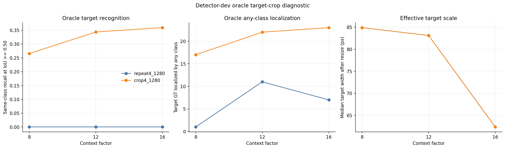

# Oracle target-crop diagnostic

## Question and boundary

Crop4-1280 improved common-class AP but still produced zero `life_saving_appliances` AP and zero
IoU-0.50 detector-dev proposal recall on full frames. This post-freeze diagnostic distinguishes two
failure modes: did Crop4 fail to learn the target category, or did full-frame inference fail to
present the small target at a recognizable scale and context?

For each of the 64 target-positive detector-dev images, the analysis uses the ground-truth target
group to create the same frozen 8×, 12×, and 16× context crops used by Crop4 training. Every
intersecting active annotation is fully included. Both Repeat4-1280 and Crop4-1280 see exactly the
same crops at `imgsz=1280`, confidence 0.001, and NMS IoU 0.70.

This is an oracle diagnostic: real inference does not know the target location. The result cannot be
reported as deployable recall and cannot select a checkpoint, threshold, or context factor.
Calibration-fit, policy-tune, and official validation are not used.

## Frozen results

| Model | Context | Target GT | Same-class matches at IoU ≥ 0.50 | Recall | Target predictions | Max target score |
|---|---:|---:|---:|---:|---:|---:|
| Repeat4-1280 | 8× | 64 | 0 | 0.000 | 0 | — |
| Repeat4-1280 | 12× | 64 | 0 | 0.000 | 0 | — |
| Repeat4-1280 | 16× | 64 | 0 | 0.000 | 0 | — |
| Crop4-1280 | 8× | 64 | 17 | 0.266 | 73 | 0.801 |
| Crop4-1280 | 12× | 64 | 22 | 0.344 | 87 | 0.801 |
| Crop4-1280 | 16× | 64 | 23 | 0.359 | 139 | 0.801 |

The Crop4 model therefore contains a real target-class representation: it produces spatially valid
same-class detections when the target is supplied at the learned crop scale. Repeat4 produces no
target-class prediction on any oracle crop, so repeated full frames did not teach the same
representation.

The mechanism is not scale alone. Median target size after resize is about 85×107 pixels at 8× and
83×106 at 12×, then falls to about 62×80 at 16×, while Crop4 recall rises across the three reported
contexts. Wider local context helps despite the smaller effective target. No single context is
selected from these detector-dev results.

## Decision

The earlier full-frame zero recall should now be interpreted principally as a proposal/presentation
failure, not proof that Crop4 failed to learn the category. A defensible next diagnostic is blind
tiling inference: cover each detector-dev frame without using target locations, merge tile
predictions in full-frame coordinates, and report all preregistered tile sizes and overlaps. That
experiment must remain separate, cannot tune on official validation, and must account for the
false-positive and latency cost across all detector-dev images.



Versioned JSON, summary CSV, and per-annotation rows are stored in
[`results/sensitivities/oracle_target_crop_diagnostic/`](../results/sensitivities/oracle_target_crop_diagnostic/).

## Reproduce

```powershell
python scripts/analyze_oracle_target_crops.py `
  --annotations artifacts/partitions/seed20260803/instances_detector_dev.json `
  --image-root D:/dataset/SeaDronesSee_ODv2/compressed/images/train `
  --model repeat4_1280 runs/detect/sds_v2_yolov8n_1280_seed20260803_rare4_noamp/weights/best.pt `
  --model crop4_1280 runs/detect/sds_v2_yolov8n_1280_seed20260803_crop4_noamp/weights/best.pt `
  --target life_saving_appliances --context 8 --context 12 --context 16 `
  --minimum-side 384 --imgsz 1280 --conf 0.001 --iou 0.70 --match-iou 0.50 `
  --batch 4 --device 0 --output-dir results/sensitivities/oracle_target_crop_diagnostic
```
