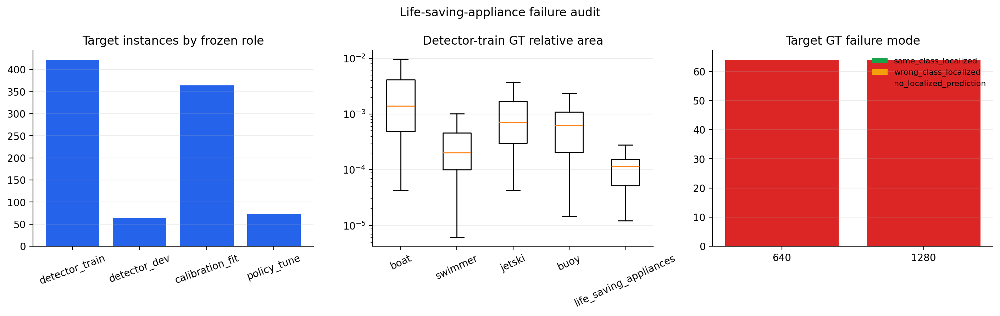

# Life-Saving-Appliance Failure Audit

## Question and boundary

The stable detector has zero AP for `life_saving_appliances` on detector-dev at both 640 and 1280
inference. This audit asks whether the failure is explained by missing training support, target size,
wrong-class localization, source-specific appearance, or absence of any localized proposal. It uses
only frozen roles derived from the official training split. Official validation is not used.

The 640 checkpoint is also evaluated diagnostically on calibration-fit and policy-tune, after the
main calibration study was frozen. Those two roles are not used for detector early stopping or model
selection. Detector-dev contains all 64 target annotations in one source group, so the audit remains
descriptive rather than a general source-generalization estimate.

## Training support and effective scale

The target class is present during training, but it is simultaneously the rarest and the smallest
active class. Effective sizes below apply the same aspect-preserving resize used before YOLO
letterboxing.

| Detector-train class | Instances | Median relative area | Median size at 640 | Median size at 1280 |
|---|---:|---:|---:|---:|
| Swimmer | 29,003 | 0.0002022 | 7.33 x 6.33 px | 14.67 x 12.67 px |
| Boat | 7,582 | 0.0013963 | 22.65 x 16.50 px | 45.31 x 33.00 px |
| Buoy | 2,927 | 0.0006366 | 10.33 x 14.17 px | 20.67 x 28.33 px |
| Jetski | 1,551 | 0.0007019 | 14.33 x 10.83 px | 28.67 x 21.67 px |
| Life-saving appliance | 422 | 0.0001148 | **5.50 x 4.83 px** | **11.00 x 9.67 px** |

The target has only 27% as many training instances as the next-rarest class. At 640, its median box
is smaller than one 8-pixel feature-map stride in both dimensions. This does not prove why learning
fails, but it supplies a concrete scale-and-frequency hypothesis that a controlled training
experiment can test.

## Frozen-role support

| Role | Instances | Images | Source groups | Relative-area median |
|---|---:|---:|---:|---:|
| Detector-train | 422 | 323 | 3 | 0.0001148 |
| Detector-dev | 64 | 64 | 1 | 0.0001144 |
| Calibration-fit | 364 | 222 | 2 | 0.0000840 |
| Policy-tune | 73 | 56 | 2 | 0.0001249 |

The median relative area is nearly identical between detector-train and detector-dev. A simple
train/dev size shift therefore does not explain the zero AP, although the class is concentrated in
few source groups.

## Low-threshold failure mode

The audit retains predictions down to confidence 0.001 and checks the highest-IoU prediction of any
class for each detector-dev target.

| Inference size | Target GT | Same-class localized | Wrong-class localized | No localized prediction | Target-class predictions | Maximum target score |
|---|---:|---:|---:|---:|---:|---:|
| 640 | 64 | 0 | 0 | 64 | 12 across 10 images | 0.0088 |
| 1280 | 64 | 0 | 0 | 64 | 6 across 6 images | 0.0155 |

This is not primarily a threshold problem or same-location class confusion. At either resolution,
no target has any prediction of any class at IoU >= 0.10. Maximum best IoU is only 0.079 at 640 and
0.058 at 1280.

The same-class 640 proposal result is also nearly zero outside detector-dev:

| Frozen role | Target GT | Matched at IoU >= 0.50 | Proposal recall | Matched source groups |
|---|---:|---:|---:|---:|
| Detector-dev | 64 | 0 | 0.0000 | 0/1 |
| Calibration-fit | 364 | 2 | 0.0055 | 1/2 |
| Policy-tune | 73 | 0 | 0.0000 | 0/2 |

Across these 501 non-training target annotations, only two are localized by the stable 640 model.
The failure is therefore not confined to the single detector-dev source group.

## Pixel and qualitative appearance audit

Per-annotation pixel statistics were computed inside each target box and an 8x local context. Raw
crops, image identifiers, and the review montage remain under ignored `artifacts/`; only aggregate
statistics are versioned.

| Role | Median target luminance | Median absolute local contrast | Median saturation |
|---|---:|---:|---:|
| Detector-train | 0.388 | 0.038 | 0.568 |
| Detector-dev | 0.874 | 0.375 | 0.328 |
| Calibration-fit | 0.485 | 0.049 | 0.555 |
| Policy-tune | 0.355 | 0.104 | 0.469 |

The central 80% of detector-dev target luminance (0.817 to 0.923) lies above the corresponding
detector-train range (0.226 to 0.546). A contrast-quantile crop review provides a matching visual
observation: selected detector-train, calibration-fit, and policy-tune examples mostly show red or
orange flotation devices next to people in water, while selected detector-dev examples show bright
appliances mounted on a white boat deck. This demonstrates a descriptive context and appearance
shift in the reviewed slices, not a causal domain-shift estimate or proof of annotation error.

## Interpretation and decision

The evidence rules out four simple explanations under the frozen setup:

- Increasing inference resolution alone does not recover the target class.
- The detector is not consistently finding the object and assigning a wrong active class.
- Detector-dev targets are not smaller than detector-train targets by median relative area.
- A failure unique to the detector-dev source cannot explain the near-zero recall on two additional
  frozen roles.

The supported working hypothesis is joint rather than singular: the target is the rarest class,
its median 640 representation is only 5.50 x 4.83 pixels, and the active label spans visibly
different object contexts. Source appearance matters, but it cannot by itself explain the failure
on calibration-fit and policy-tune.

A standalone 1280 run is not yet a clean rare-class explanation. The next experiment should freeze
a small factorial comparison: input resolution (640 vs 1280) by rare-positive exposure (natural vs
repeated), reuse the stable 640 natural-sampling run as one cell, use detector-dev only for stopping,
and evaluate the two other frozen roles once per completed checkpoint as diagnostics. The combined
1280-plus-repeat cell should run only if the two main-effect cells show a useful signal. Official
validation must remain unused.

Compact aggregate tables and JSON are stored in
[`results/sensitivities/rare_class_audit`](../results/sensitivities/rare_class_audit). Per-annotation
failures, per-crop features, and review montages remain under ignored `artifacts/`.
