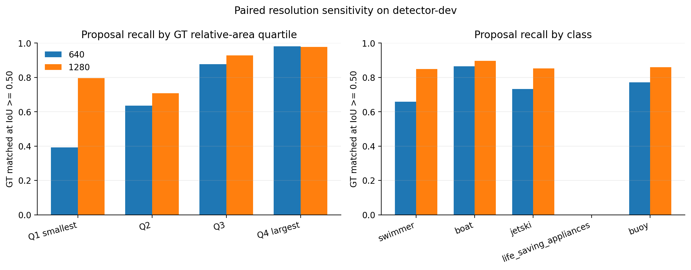

# Paired 640 vs 1280 Inference Sensitivity

## Design

This experiment evaluates one frozen, 640-trained YOLOv8n checkpoint at two inference resolutions
on `detector-dev`. Model weights, image identities, confidence floor (0.001), NMS IoU (0.70),
maximum detections, matching IoU (0.50), and software environment are identical. Batch changes from
16 to 4 only to fit 1280-pixel inference in memory. Official validation is not used.

This is an inference-resolution result. It does not estimate the effect of training a detector at
1280 pixels.

## Aggregate result

| Metric | 640 | 1280 | Difference |
|---|---:|---:|---:|
| Precision | 0.83603 | 0.85669 | +0.02066 |
| Recall | 0.52121 | 0.61035 | +0.08914 |
| mAP50 | 0.54068 | 0.62457 | +0.08390 |
| mAP50-95 | 0.27981 | 0.35946 | +0.07965 |

End-to-end measured preprocessing, inference, and postprocessing latency increases from 5.16 to
10.67 ms per image, a 2.07x ratio on the RTX 4070 Laptop GPU. These are local benchmark timings,
not deployment guarantees.

At IoU >= 0.50 and the low confidence floor, proposal recall rises from 0.7217 to 0.8530. The paired
improvement is +0.1313, with a 95% grouped-bootstrap interval of [+0.0230, +0.1792] across the seven
detector-development source groups.

## Ground-truth size analysis

Size bins are quartiles of ground-truth relative box area on detector-dev. The quartile boundaries
were registered as a descriptive paired analysis and were not used for model or threshold tuning.

| GT size quartile | Ground truths | Recall 640 | Recall 1280 | Difference | 95% grouped CI |
|---|---:|---:|---:|---:|---:|
| Q1 smallest | 1,353 | 0.392 | 0.796 | +0.404 | [+0.287, +0.459] |
| Q2 | 1,357 | 0.635 | 0.708 | +0.073 | [-0.088, +0.191] |
| Q3 | 1,367 | 0.876 | 0.929 | +0.053 | [-0.007, +0.080] |
| Q4 largest | 1,360 | 0.981 | 0.978 | -0.003 | [-0.012, +0.005] |

The gain is concentrated in the smallest quartile. For the largest quartile, the point estimate is
effectively unchanged and the interval includes zero. This is the expected signature of a genuine
small-target resolution effect rather than a uniform score shift.

## Class result

Proposal recall improves for swimmer (+0.190), jetski (+0.121), buoy (+0.088), and boat (+0.032).
The life-saving-appliance class remains 0/64 at both resolutions and occurs in only one
detector-development source group, so a grouped class-specific uncertainty interval is not
estimable. Its failure cannot be attributed to inference resolution alone.

## Decision

1280 inference is justified when small-target recall is worth roughly doubling local per-image
latency. A full 1280 training run is deferred rather than automatically launched: the cheap paired
gate already establishes the resolution effect, while the rare class—the clearest unresolved
failure—does not improve at all. The next higher-value experiment is a documented rare-class audit
covering source concentration, train/dev support, size distribution, prediction confusions, and
annotation examples. Full 1280 training can then be reconsidered with a specific hypothesis.

The subsequent [rare-class audit](RARE_CLASS_AUDIT.md) finds no localized proposal of any class even
at the 0.001 confidence floor and identifies severe source concentration, so resolution alone is
not a supported explanation for the rare-class failure.

Machine-readable aggregate metrics, compact size/class tables, and plots are stored in
[`results/sensitivities/resolution_inference`](../results/sensitivities/resolution_inference).
The 5,437-row paired GT table remains under ignored `artifacts/` and is regenerated by the analysis
command rather than committed as a public result. Full Ultralytics validation directories also stay
under ignored `artifacts/` because their batch visualizations contain source dataset imagery.
