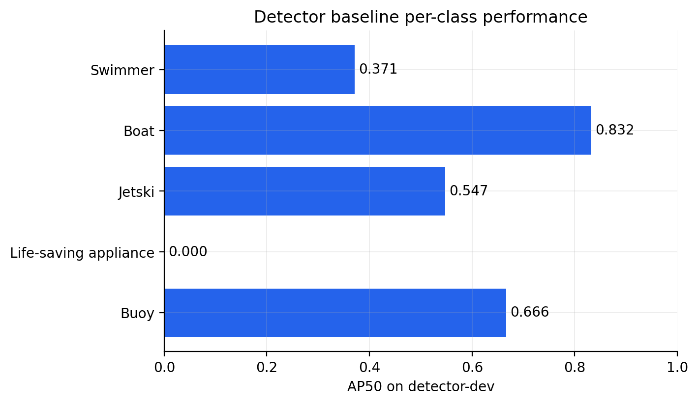
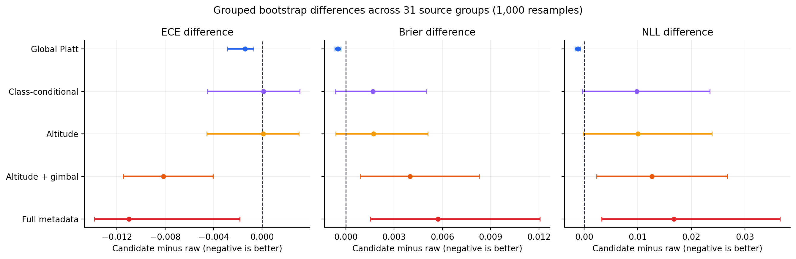
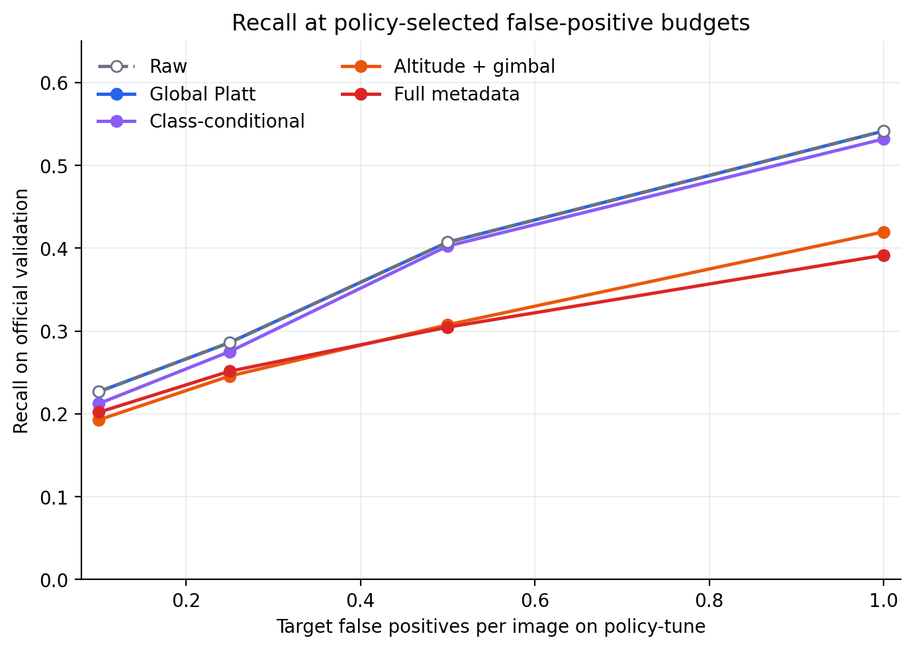
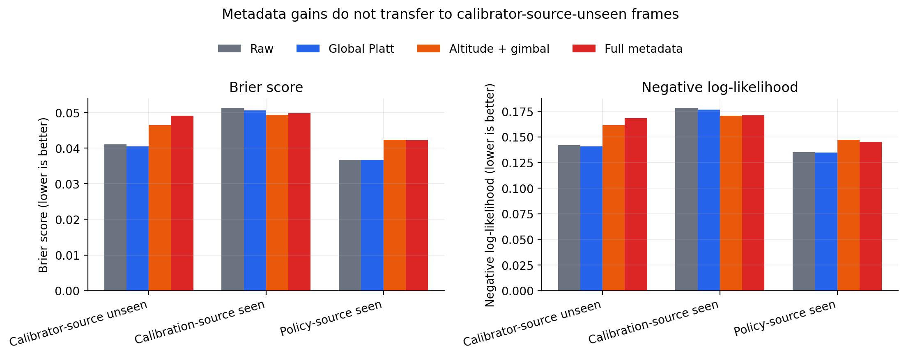

# Preliminary Results

These are the frozen results of the first reproducible baseline. They are preliminary research
evidence, not a deployment claim. All detector checkpoints were selected on `detector-dev`; the
official validation split was not used for model or threshold selection.

## Evaluation scope

- Primary complete-case validation: 1,093 images with altitude and gimbal metadata, 6,882 ground
  truths, and 45,204 detections exported at confidence 0.001.
- All-image sensitivity validation: 1,547 images, 9,630 ground truths, and 66,230 detections.
- At the export floor, the detector proposed a correct IoU >= 0.50 match for 5,048/6,882 (73.4%)
  complete-case ground truths. Calibration cannot recover the remaining 1,834 missed objects.
- Calibration metrics are computed over low-threshold detections. Operating thresholds are chosen
  on the separate `policy-tune` role and then transferred unchanged to official validation.

## Detector baseline

YOLOv8n at 640 px stopped after 28/100 requested epochs, with the best checkpoint at epoch 8.
AutoBatch selected 16. On the 893-image `detector-dev` role, the best checkpoint reached precision
0.774, recall 0.486, AP50 0.483, and AP50-95 0.238.

| Class | Instances | AP50 | AP50-95 |
|---|---:|---:|---:|
| Swimmer | 3,115 | 0.371 | 0.106 |
| Boat | 1,533 | 0.832 | 0.515 |
| Jetski | 306 | 0.547 | 0.201 |
| Life-saving appliance | 64 | 0.000 | 0.000 |
| Buoy | 419 | 0.666 | 0.370 |

Training metrics collapsed after epoch 8 and never recovered before early stopping. The selected
checkpoint is valid under the frozen protocol, but this instability and the complete failure on the
rare life-saving-appliance class make a stronger-detector sensitivity run necessary before drawing
broad conclusions about the task. A same-seed deterministic replay reproduced every non-runtime
numeric field exactly, including the epoch-9 collapse; see the
[stability replication](STABILITY_REPLICATION.md).



## Calibration result

Lower is better for every metric in this table.

| Variant | ECE | Brier | NLL |
|---|---:|---:|---:|
| Raw | 0.02224 | 0.04238 | 0.14809 |
| Global Platt | **0.02085** | **0.04189** | **0.14691** |
| Class-conditional | 0.02237 | 0.04407 | 0.15790 |
| Altitude | 0.02235 | 0.04410 | 0.15812 |
| Altitude + gimbal | 0.01410 | 0.04638 | 0.16072 |
| Full metadata | 0.01123 | 0.04811 | 0.16485 |

Full metadata reduces 15-bin ECE by 49.5% relative to raw scores, but increases Brier score by
13.5% and NLL by 11.3%. This is not an overall calibration improvement: ECE is bin-dependent and
can reward locally distorted probabilities, while Brier score and NLL are proper scoring rules.

Grouped bootstrap over 31 evaluation source groups (1,000 resamples) reinforces this distinction:

| Candidate vs raw | Metric difference | 95% bootstrap interval | Interpretation |
|---|---:|---:|---|
| Global Platt | ECE -0.00139 | [-0.00283, -0.00068] | Better |
| Global Platt | Brier -0.00049 | [-0.00068, -0.00031] | Better |
| Global Platt | NLL -0.00118 | [-0.00171, -0.00068] | Better |
| Altitude + gimbal | ECE -0.00814 | [-0.01148, -0.00404] | Better ECE only |
| Altitude + gimbal | Brier +0.00399 | [+0.00090, +0.00832] | Worse |
| Altitude + gimbal | NLL +0.01263 | [+0.00236, +0.02673] | Worse |
| Full metadata | ECE -0.01101 | [-0.01384, -0.00184] | Better ECE only |
| Full metadata | Brier +0.00573 | [+0.00154, +0.01206] | Worse |
| Full metadata | NLL +0.01676 | [+0.00328, +0.03655] | Worse |



## Fixed false-positive budgets

At a target of 0.5 false positives per policy-tune image, raw and global Platt scores both reach
0.407 validation recall. Their result is identical because global Platt calibration is monotonic and
therefore preserves ranking. Altitude + gimbal reaches 0.308 recall and full metadata reaches 0.305.
The metadata variants do not improve the operational endpoint under the frozen threshold policy.



## Source-role diagnostic

Metadata variants improve Brier/NLL on frames from sources used to fit the calibrator, but degrade
both metrics on calibrator-source-unseen frames. For example, on the unseen-source diagnostic, raw,
global Platt, altitude + gimbal, and full-metadata Brier scores are 0.04105, 0.04052, 0.04649, and
0.04912 respectively. This pattern is consistent with metadata overfitting.



This is not a true held-out-video experiment. Every official validation source group also appears in
at least one official-training-derived role because the benchmark uses a same-video frame split.
Source-role results are diagnostic only and must not be described as source generalization.

## Answers to the frozen hypotheses

- H1 remains descriptive rather than causal. Calibration varies across altitude, gimbal, size, and
  category slices, but the existing split cannot separate metadata effects from source and class.
- H2 is supported for this baseline. Global Platt scaling improves ECE, Brier score, and NLL with
  grouped confidence intervals below zero.
- H3 is rejected for this baseline. Metadata-aware variants lower ECE but worsen proper scores and
  recall at fixed false-positive budgets, especially on calibrator-source-unseen frames.

## Reproduce the public report

After producing the ignored run and artifact directories, rebuild every versioned table and figure:

```powershell
python scripts\build_public_results.py `
  --run-dir runs\detect\sds_v2_yolov8n_640_seed20260803 `
  --training-log runs\detect\baseline.stdout.log `
  --complete-case-dir artifacts\calibration\complete_case `
  --all-images-dir artifacts\calibration\all_images `
  --analysis-dir artifacts\analysis\complete_case `
  --metadata-val-summary artifacts\tables\official_val.summary.json `
  --all-val-summary artifacts\tables\official_val_all_images.summary.json `
  --output-dir results
```

The machine-readable detector manifest, compact result tables, bootstrap intervals, and figures are
stored in [`results/`](../results/). Raw images, predictions, fitted models, and weights remain
excluded from version control.

## Post-freeze rare-class diagnosis

The stable detector localized only 2 of 501 `life_saving_appliances` annotations across
detector-dev, calibration-fit, and policy-tune at confidence 0.001 and IoU 0.50. In detector-train,
this is the rarest active class (422 instances) and its median full-frame 640 representation is only
5.50 x 4.83 pixels. Aggregate crop statistics and a local, ignored montage also expose a strong
descriptive appearance/context difference between detector-dev and the other frozen roles. These
findings motivate a post-freeze resolution-by-rare-positive-sampling control; they do not alter the
frozen official-validation calibration result. See the [rare-class audit](RARE_CLASS_AUDIT.md).

The registered Repeat4-640 control subsequently completed after a checkpoint-faithful power-loss
resume. Repeated rare-positive exposure increased IoU-0.50 target matches across the three frozen
roles from 2/501 to 16/501, while detector-dev aggregate mAP50-95 changed from 0.27981 to 0.27392
(-2.10% relative). Detector-dev target AP50-95 and target recall nevertheless remained zero, so
this is evidence for better low-confidence proposal localization rather than a solved rare class.
The Natural-1280 main-effect cell then raised detector-dev aggregate mAP50-95 from 0.27981 to
0.36570 (+30.70% relative) and raised cross-role low-threshold target matches from 2/501 to 65/501.
However, detector-dev `life_saving_appliances` AP50-95 and proposal recall both remained zero.
The final Repeat4-1280 interaction cell reached 0.35690 aggregate mAP50-95 and 73/501 cross-role
target matches. For aggregate mAP50-95, the exposure effects at 640 and 1280 are -0.00589 and
-0.00880; the resolution effects under natural and Repeat4 exposure are +0.08589 and +0.08298; the
difference-in-differences is -0.00291. Target proposal localization also shows a negative
interaction: the exposure gain falls from 14 additional matches at 640 to 8 at 1280. All four cells
retain zero detector-dev target AP50-95 and zero target proposal recall. Resolution is therefore the
dominant robust factor, while repeated exposure provides smaller, sub-additive post-freeze proposal
gains and does not solve the target-domain failure. See the
[registered control report](RARE_CLASS_FACTORIAL.md).

A four-cell detector-dev error taxonomy then inspected the highest-IoU prediction of any class and
of the target class for each of the 64 target annotations. No target-class prediction has positive
IoU with a target annotation in any cell, and no any-class prediction reaches IoU 0.50. The 1280
cells produce only limited low-IoU overlap from `boat` or `swimmer` boxes; Repeat4-1280 reaches
12/64 targets at IoU 0.10 but none at IoU 0.30. This is coarse contextual proximity, not recovered
target localization. The evidence rejects more whole-frame repetition and motivates a separately
preregistered object-centric crop or tiling control. See the
[four-cell target error taxonomy](TARGET_ERROR_TAXONOMY_2X2.md).

The matched Crop4-1280 control then replaced the 969 extra whole-frame repeats with 969
deterministic target-group-centered crops while keeping 7,220 total exposures and 1,688 effective
target-instance exposures. It improved detector-dev aggregate mAP50-95 from 0.35690 to 0.36305,
but target AP50-95 and IoU-0.50 proposal recall remained zero. Across detector-dev,
calibration-fit, and policy-tune, target matches fell from 73/501 for Repeat4 to 39/501 for Crop4.
The result rejects this object-centric crop recipe as a rare-target repair: its small aggregate
gain is confined to non-target classes. The two post-freeze roles were used once as non-selection
diagnostics, and official validation was not used. See the
[object-centric crop control](OBJECT_CENTRIC_CROP_CONTROL.md).

An oracle target-crop diagnostic then supplied detector-dev target locations only to distinguish
representation from proposal failure. On the same frozen 8×, 12×, and 16× local contexts,
Crop4-1280 recovered 17/64, 22/64, and 23/64 target annotations at IoU 0.50, while Repeat4-1280
produced zero target-class predictions throughout. Crop4 therefore learned a recognizable target
representation; its full-frame zero recall is principally a proposal/presentation failure. These
oracle recalls are not deployable and do not select a context factor. See the
[oracle target-crop diagnostic](ORACLE_TARGET_CROP_DIAGNOSTIC.md).

The registered location-blind tiling sensitivity then covered every detector-dev frame with fixed
384- and 768-pixel tiles at 25% overlap. Crop4 recovered 13/64 and 14/64 target annotations at IoU
0.50, while Repeat4 remained at 0/64 for both scales. This confirms, without oracle locations,
that Crop4 contains a usable target representation. It does not establish a deployable tiling
configuration: Crop4 target AP50 is only 0.00026 and 0.00084, aggregate mAP50-95 falls to 0.07030
and 0.23596, and false positives rise to 279.68 and 154.62 per image. Capped and uncapped target
recall are identical, so the recovered matches are not artifacts of bypassing the 300-detection
budget. No tile size is selected from detector-dev. See the
[blind tiling inference sensitivity](BLIND_TILING_INFERENCE_SENSITIVITY.md).

A frozen target-class false-positive audit then separated the tiled errors without rerunning or
filtering predictions. Crop4 produces 20.01 and 4.77 target-class false positives per detector-dev
image at 384 and 768, respectively; these are narrower than the preceding all-class FP rates.
Background accounts for 73.14% and 58.64%, while overlap or proximity to another active class
accounts for 26.67% and 40.68%. Swimmer is the largest annotated association. Half or more of the
Crop4 false positives also retain another target-class neighbor at IoU at least 0.50 after the
frozen 0.70 cross-tile NMS. Confidence does not cleanly separate the recovered targets from false
positives, and grid alignment is descriptive because tile provenance was not retained. No proposal
rule, merge rule, threshold, or tile size is selected; see the
[blind-tiling false-positive audit](BLIND_TILING_FP_AUDIT.md).

## External source-sequence holdout readiness

A read-only source and file-integrity inventory found no locally available untouched source
sequence for a blind follow-up. Detector-train, detector-dev, calibration-fit, and policy-tune
together cover all 8,930 official-training images and all 38 source groups, with zero overlap among
the roles. The protected official validation split contains 1,547 images from 33 source groups, but
all 33 groups also occur in official train; source metadata alone therefore confirms that it is not
a source-disjoint development holdout. No official-validation labels, predictions, or metrics were
summarized, and no model, inference, training, or dataset mutation was involved.

That external-data gate was subsequently satisfied with the official MOBDrone `DJI_0804` test
domain. A preregistered one-in-30 fixed-rate sample contains 1,264 frames from 26 independent source
videos, including 350 mapped lifebuoys and 915 target-negative frames. Annotation MD5, selected ZIP
entry CRC32 and byte counts, per-video SHA-256, frame geometry, per-frame SHA-256, and zero
normalized SeaDronesSee source overlap were verified before inference. The full video-archive MD5
was not locally verified because only the 26 preregistered ZIP members were acquired by byte range.

On this target-only external endpoint, full-frame Repeat4 reaches 44/350 matches, AP50 0.0791, and
0.0854 target false positives per image; full-frame Crop4 reaches 30/350, AP50 0.0346, and 0.3544
target false positives per image. Blind tiles expose Crop4's learned representation across source
videos: Crop4-384 and Crop4-768 reach 188/350 and 132/350 matches with AP50 0.3055 and 0.2186.
However, they also produce 7.9794 and 3.4098 target false positives per image and trigger 81.09%
and 60.11% of target-negative frames. Repeat4 reaches 0/350 and 2/350 under the same tile arms.
This independently supports the representation/presentation mechanism but not a deployable tiling
rule. No checkpoint, threshold, merge rule, or tile size is selected; no cross-dataset aggregate
mAP is reported; official validation was not used. See the
[MOBDrone external target-only holdout](MOBDRONE_EXTERNAL_HOLDOUT.md) and the historical
[local readiness inventory](EXTERNAL_HOLDOUT_READINESS.md).

## Post-freeze detector-stability sensitivity

A planned follow-up repeated the complete pipeline with the stable 640 no-AMP checkpoint. Detector
quality and low-threshold proposal coverage improved, but metadata-aware calibration again lowered
ECE while worsening Brier score, NLL, and fixed-budget recall. Global Platt point estimates improved,
although grouped bootstrap support was conclusive only for Brier score. See the separate
[stable-detector sensitivity report](STABLE_640_SENSITIVITY.md); it is not presented as a new
untouched-validation result.
