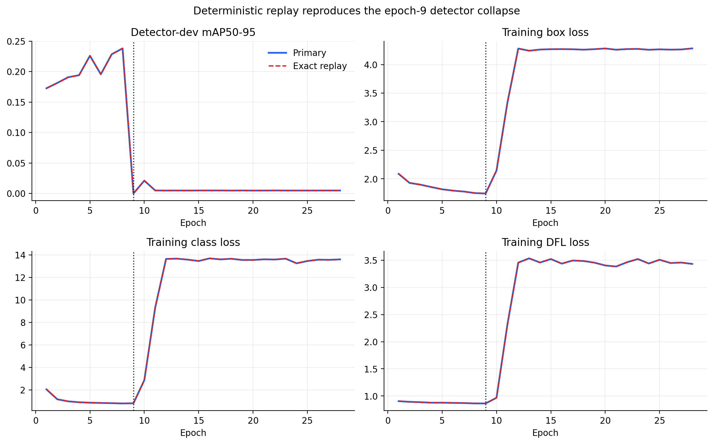
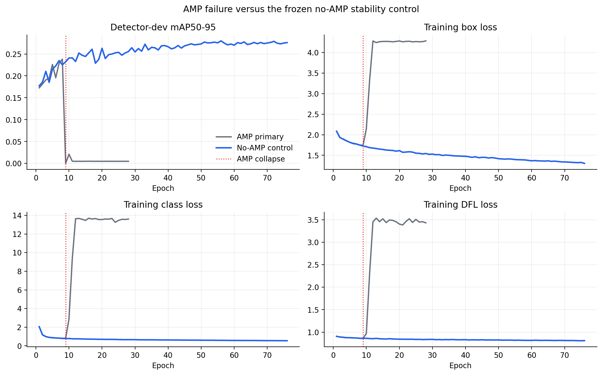

# Detector Stability Replication

## Motivation

The primary YOLOv8n 640 run improved through epoch 8, produced near-zero development AP at epoch 9,
and then showed progressively increasing training losses. The best checkpoint is finite and usable,
but the stripped final checkpoint has a substantially larger weight norm. Dataset integrity checks,
the learning-rate trace, and the training log did not reveal invalid images, invalid boxes, NaNs, or
an abrupt learning-rate change.

This document freezes the diagnostic sequence before any follow-up detector result is inspected.

## Stage A: exact deterministic replay

Replay the primary detector with the same:

- official-training-derived detector-train and detector-dev lists;
- YOLOv8n initialization file and SHA-256;
- input size 640, AutoBatch, AMP, optimizer selection, augmentations, patience, and seed;
- Python, PyTorch, Ultralytics, CUDA device, and worker count.

Use a distinct run directory and retain the full stdout/stderr logs. Do not use official validation
for checkpoint selection. Compare:

1. whether development AP collapses at the same epoch;
2. completed and best epochs;
3. per-epoch loss and AP traces;
4. best-checkpoint SHA-256 and metrics;
5. finite-value checks and weight norms for best and final checkpoints.

Exact replay command:

```powershell
python scripts\train_yolo.py `
  --data D:\dataset\SeaDronesSee_ODv2\yolo\seadronessee_detector.yaml `
  --model yolov8n.pt `
  --imgsz 640 `
  --epochs 100 `
  --batch -1 `
  --device 0 `
  --workers 4 `
  --seed 20260803 `
  --project runs\detect `
  --name sds_v2_yolov8n_640_seed20260803_replay
```

## Stage B: single-factor stability control

Run this stage only if Stage A reproduces the collapse. Change one numerical factor at a time. The
first control disables AMP and uses the largest fixed batch that passes a preflight memory check;
all other model, data, seed, optimizer, and augmentation settings remain unchanged. If batch must be
reduced, record it as a co-change and do not attribute stabilization solely to AMP.

Do not launch the 1280-pixel small-target sensitivity experiment until one 640-pixel run remains
stable through early stopping. This prevents resolution effects from being confounded with an
unresolved optimization failure.

## Stage A result

Stage A completed on 2026-08-04 and exactly reproduced the failure.

| Check | Primary | Exact replay |
|---|---:|---:|
| Effective batch | 16 | 16 |
| Best epoch | 8 | 8 |
| First collapse epoch | 9 | 9 |
| Completed epochs | 28 | 28 |
| Best detector-dev mAP50-95 | 0.23812 | 0.23812 |
| Standard-error log bytes | 0 | 0 |

The comparison covers every numeric `results.csv` field except wall-clock time: training and
validation losses, precision, recall, AP, and all learning-rate columns are exactly equal at all 28
epochs, with a maximum absolute difference of zero. The collapse definition was frozen as the first
epoch at or below 10% of the previous best detector-dev mAP50-95.

The serialized `best.pt` files have different SHA-256 values because the checkpoint containers hold
run-specific metadata such as timestamps. After hashing the ordered model tensors only, both best
checkpoints have the same state hash
`37edbc3da02741db9eb3e08c0ade97bf2a32824efc162eb133512bb6d4e4e5ea`; the final checkpoints also
share state hash `62561130eff888a4c3671691cac5a5defa0023c999d954f35ecb6b2790c89d1a`.
Every tensor is bitwise identical between the two runs and contains zero non-finite values.

The final model state has L2 weight norm 406.29 and maximum absolute weight 73.5, compared with
151.98 and 17.86 in the best checkpoint. Combined with the identical loss and AP trajectory, this
confirms a deterministic optimization failure under the frozen environment rather than a transient
GPU, filesystem, or data-loading interruption.



The full machine-readable comparison is stored in
[`results/stability_replay.json`](../results/stability_replay.json). Stage B remains the next gated
experiment; no 1280-pixel run should start before a stable 640-pixel control is obtained.

## Stage B registration

The Stage B control is frozen in [`configs/stability_noamp.yaml`](../configs/stability_noamp.yaml).
It uses fixed batch 16, which is the effective batch selected by AutoBatch in both failed runs, and
changes only AMP from enabled to disabled. Model initialization, data lists, image size, seed,
optimizer selection, learning-rate argument, augmentations, workers, patience, and checkpoint
selection remain unchanged.

A one-epoch 2% data run is allowed only as a CUDA-memory preflight. It cannot be reported as a model
result. Passing requires a normal exit without CUDA OOM or non-finite loss. The full control is
stable only if it has no collapse under the already frozen 10%-of-previous-best definition, its best
and final model tensors are finite, and its error log contains no GPU, disk, or dataloader failure.

The preflight passed on 2026-08-04: batch 16 without AMP used 3.92 GiB reported GPU memory, all three
training losses were finite, the process exited normally, and stderr was empty. Its 2%-data detector
metric is excluded from all research comparisons. The machine-readable gate record is
[`results/stability_noamp_preflight.json`](../results/stability_noamp_preflight.json).

The first full-data launch did not produce a model result. It stopped during the second backward
pass of epoch 1 with `CUDNN_STATUS_BAD_PARAM_STREAM_MISMATCH`, after reporting 3.96 GiB GPU memory.
No `results.csv`, checkpoint, or run manifest was produced, so this attempt is excluded from the AMP
stability comparison and must not be interpreted as evidence for or against the no-AMP hypothesis.
The failed run directory and both logs are retained. A structured incident record is stored in
[`results/stability_noamp_attempt1.json`](../results/stability_noamp_attempt1.json).

One exact launch reproduction is registered before changing the dataloader or cuDNN settings. Its
only changes are the run name and log paths. If the same launch failure repeats, no further identical
restart is allowed; the next experiment must be registered as an execution-compatibility diagnostic
and cannot be presented as the original single-factor AMP control.

## Stage B result

The exact no-AMP launch reproduction completed normally on 2026-08-04. It used the frozen model,
data lists, image size, seed, effective batch 16, four workers, optimizer selection, and patience;
the registered numerical change was AMP enabled to disabled. The official validation split was not
used for checkpoint selection.

| Check | AMP primary | No-AMP control |
|---|---:|---:|
| Effective batch | 16 | 16 |
| Best epoch | 8 | 56 |
| First collapse epoch | 9 | none |
| Completed epochs | 28 | 76 |
| Best detector-dev mAP50-95 | 0.23812 | 0.27992 |
| Best detector-dev mAP50 | 0.48334 | 0.54063 |
| Best detector-dev precision | 0.77603 | 0.83559 |
| Best detector-dev recall | 0.48379 | 0.52136 |
| Standard-error log bytes | 0 | 0 |

The no-AMP run passed every registered stability gate: it never crossed the frozen collapse
threshold, both best and final checkpoints contain zero non-finite model values, and stderr is
empty. Its best checkpoint SHA-256 is
`cccc90e9303a37ddc8131288f59b68547c0e05c696d9472fee4f650d16ae5321`; the final checkpoint SHA-256
is `98ba9d0594b3e95e92763bd74d0f530afa4f1f1ae1f7a054dd9286592663a13b`.

The result supports the AMP execution path as an explanation for the deterministic collapse under
this frozen environment: disabling AMP was sufficient to remove the failure and improved best
detector-dev mAP50-95 by 0.04180. It remains a single controlled run, so it does not prove a general
Ultralytics, PyTorch, CUDA, or hardware defect. The earlier full-data no-AMP launch that stopped with
a cuDNN stream-mismatch error is retained as an execution incident and is not treated as a model
result.



The complete machine-readable comparison, frozen-input checks, checkpoint statistics, and gate
outcome are stored in [`results/stability_noamp.json`](../results/stability_noamp.json).
