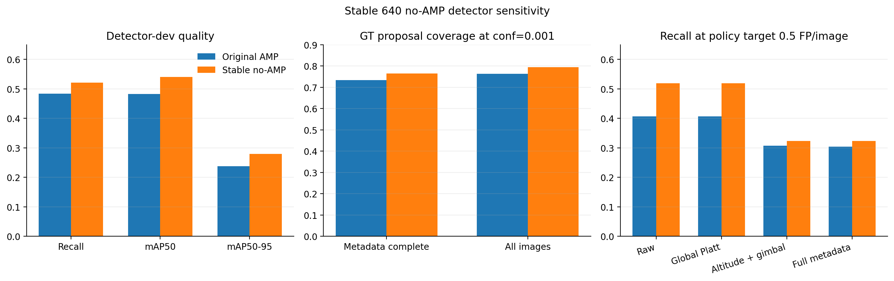

# Stable 640 Detector Calibration Sensitivity

## Status and claim boundary

This planned sensitivity analysis repeats the frozen calibration pipeline using the numerically
stable YOLOv8n 640 no-AMP checkpoint. The checkpoint was selected only on `detector-dev`; official
validation was not used for model selection. Calibration variants, the confidence export floor,
matching IoU, ECE bins, policy budgets, source-disjoint roles, and bootstrap procedure were held
fixed.

The official validation set had already been inspected for the original baseline. This analysis
therefore tests whether the original conclusions persist under a stable detector; it is not a new
untouched-validation confirmation and does not replace the original frozen result.

## Detector and proposal coverage

The stable checkpoint improves every aggregate detector-development metric.

| Metric | Original AMP | Stable no-AMP | Difference |
|---|---:|---:|---:|
| Precision | 0.77603 | 0.83559 | +0.05956 |
| Recall | 0.48379 | 0.52136 | +0.03757 |
| mAP50 | 0.48334 | 0.54063 | +0.05729 |
| mAP50-95 | 0.23812 | 0.27992 | +0.04180 |

Per-class detector-dev AP50-95 improves for swimmer (0.106 to 0.162), boat (0.515 to 0.533),
jetski (0.201 to 0.277), and buoy (0.370 to 0.427). The rare life-saving-appliance class remains at
zero AP on 64 instances, so detector stability alone does not solve the rare-class failure.

At the frozen confidence floor of 0.001, complete-case official-validation proposal coverage rises
from 5,048/6,882 (73.35%) to 5,264/6,882 (76.49%), while exported detections fall from 45,204 to
36,236. Across all official-validation images, coverage rises from 7,347/9,630 (76.29%) to
7,653/9,630 (79.47%), while predictions fall from 66,230 to 50,269. The stable detector therefore
recovers more matchable ground truths with fewer low-confidence proposals.

## Calibration sensitivity

Lower is better for ECE, Brier score, and NLL.

| Variant | ECE | Brier | NLL |
|---|---:|---:|---:|
| Raw | 0.02629 | 0.04537 | 0.15630 |
| Global Platt | 0.02624 | **0.04454** | **0.15492** |
| Class-conditional | 0.02283 | 0.04779 | 0.16375 |
| Altitude | 0.01971 | 0.04759 | 0.16448 |
| Altitude + gimbal | **0.01481** | 0.04949 | 0.16692 |
| Full metadata | 0.01497 | 0.04957 | 0.16715 |

Global Platt scaling improves all three point estimates relative to raw confidence, but the grouped
bootstrap interval is entirely below zero only for Brier score: ECE and NLL include zero. Thus the
original global-calibration result is directionally reproduced but statistically weaker under the
stable detector.

The metadata result is more robust. For both altitude + gimbal and full metadata, the grouped
bootstrap interval is below zero for ECE but above zero for Brier and NLL. Metadata conditioning
again improves a bin-dependent calibration statistic while significantly worsening both proper
scoring rules.

## Fixed false-positive policy

At the policy-tune target of 0.5 false positives per image, stable raw and global Platt scores reach
0.519 validation recall, compared with 0.407 for the original detector. Their results remain
identical because global Platt scaling is monotonic. Altitude + gimbal and full metadata reach only
0.324 recall, so the planned metadata-aware operational advantage is again rejected.

## Conclusion

The stronger stable detector improves detection and proposal coverage, but it does not rescue the
metadata-aware calibration hypothesis. The main negative result persists: metadata variants lower
ECE while worsening Brier score, NLL, and fixed-budget recall. The global Platt conclusion should be
stated more cautiously: its point estimates improve, with bootstrap support that is conclusive only
for Brier score in this sensitivity.

The remaining detector limitation is concentrated in the rare life-saving-appliance class. The
subsequent [paired 640-versus-1280 detector-dev experiment](RESOLUTION_INFERENCE_SENSITIVITY.md)
shows a strong small-target benefit but no improvement for that rare class, so a targeted failure
audit now precedes any full 1280 training run.

Machine-readable comparisons and versioned tables are stored in
[`results/sensitivities/stable_640_noamp`](../results/sensitivities/stable_640_noamp).
