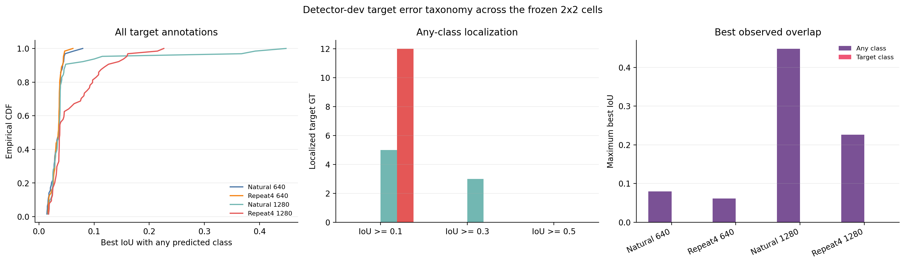

# Four-Cell Target Error Taxonomy

## Question and boundary

The completed resolution-by-exposure factorial left `life_saving_appliances` at zero AP and zero
IoU-0.50 proposal recall on detector-dev in all four cells. This post-freeze analysis asks a narrower
question: do the models fail because no box reaches the target, or because a spatially valid box is
assigned to another active class?

All predictions were exported at confidence 0.001 and NMS IoU 0.70 from the already selected
detector-dev checkpoints. The analysis does not choose checkpoints, thresholds, or a new training
method. Official validation is not used. Detector-dev contains 64 target annotations from one source
group, so the result diagnoses this frozen split rather than cross-source generalization.

## Method

For every target annotation and each factorial cell, the analysis records:

- the highest-IoU prediction of any active class;
- the highest-IoU prediction assigned to `life_saving_appliances`;
- the predicted category and confidence of the highest-overlap box;
- localization counts at IoU 0.10, 0.30, and 0.50.

The reproducible command is:

```powershell
python scripts\analyze_target_error_taxonomy_2x2.py `
  --annotations artifacts\partitions\seed20260803\instances_detector_dev.json `
  --prediction natural_640=artifacts\sensitivities\resolution_inference\predictions\detector_dev_640.json `
  --prediction repeat4_640=artifacts\sensitivities\rare_class_factorial\predictions\detector_dev.json `
  --prediction natural_1280=artifacts\sensitivities\rare_class_factorial\predictions\natural_1280_detector_dev.json `
  --prediction repeat4_1280=artifacts\sensitivities\rare_class_factorial\predictions\repeat4_1280_detector_dev.json `
  --target life_saving_appliances --threshold 0.10 --threshold 0.30 --threshold 0.50 `
  --output-dir results\sensitivities\target_error_taxonomy_2x2
```

## Results

No target-class prediction overlaps any of the 64 target annotations in any cell: maximum same-class
best IoU is exactly 0.0 throughout. Lowering the target confidence threshold further therefore cannot
recover detector-dev recall from these exported candidates.

| Cell | Target predictions | Max target score | Any class IoU >= 0.10 | IoU >= 0.30 | IoU >= 0.50 | Max any-class IoU |
|---|---:|---:|---:|---:|---:|---:|
| Natural-640 | 12 | 0.0088 | 0/64 | 0/64 | 0/64 | 0.0795 |
| Repeat4-640 | 20 | 0.4044 | 0/64 | 0/64 | 0/64 | 0.0617 |
| Natural-1280 | 7 | 0.2225 | 5/64 | 3/64 | 0/64 | 0.4478 |
| Repeat4-1280 | 26 | 0.4358 | 12/64 | 0/64 | 0/64 | 0.2264 |

At 1280, a small number of target annotations gain low-IoU overlap from boxes labelled `boat` or
`swimmer`. This is not evidence that the appliance itself is cleanly localized under the wrong
class: a boat box can contain or partially overlap a much smaller appliance mounted on the deck.
No any-class prediction reaches IoU 0.50, and no target-class box has positive overlap.

The IoU-0.10 any-class localization interaction is positive because Repeat4-1280 reaches 12 targets
versus 5 for Natural-1280, while neither 640 model reaches any. That signal disappears at IoU 0.30:
Natural-1280 reaches three targets and Repeat4-1280 reaches none. It also disappears completely at
IoU 0.50. The interaction is therefore coarse spatial proximity, not usable target detection.

## Interpretation and next decision

The four-cell evidence rejects three immediate follow-ups:

- further lowering the target confidence threshold;
- more whole-frame rare-positive repetition;
- resolution-only scaling as a target-class remedy.

The remaining error is principally absence of target-specific localization. Combined with the
earlier appearance audit—floating red/orange devices in several roles versus bright appliances on a
boat deck in detector-dev—the next defensible training candidate is a detector-train-only,
object-centric crop or tiling control. It should enlarge the rare object while preserving enough
local context, stratify exposures by source/context, hold total optimizer exposure comparable, and
continue to use detector-dev only for ordinary early stopping. Calibration-fit and policy-tune must
remain one-time diagnostics; official validation must remain untouched.

That candidate is a recommendation, not an authorized experiment. It requires a separate
preregistration and data-integrity gate before any new training.



Machine-readable summaries and per-annotation rows are stored in
[`results/sensitivities/target_error_taxonomy_2x2`](../results/sensitivities/target_error_taxonomy_2x2).
